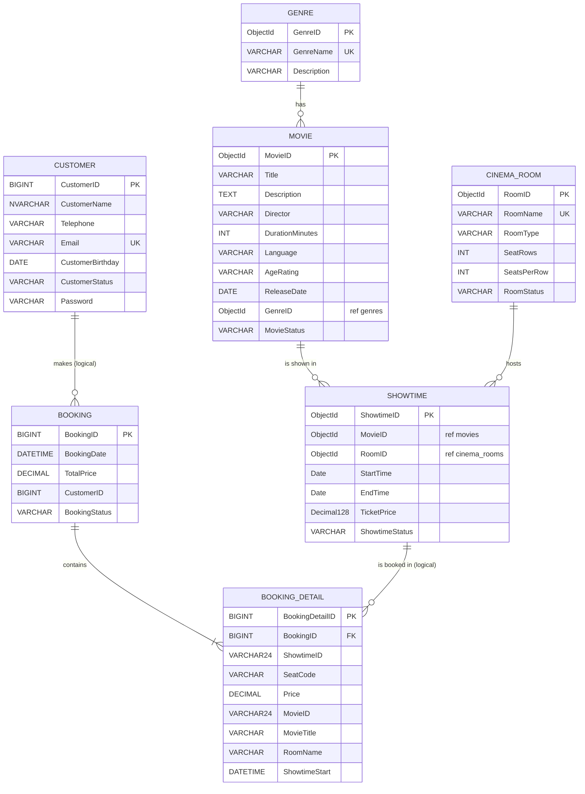

# Assignment 01 for MSS301 – Cinema Ticket Booking System using API Gateway

> **Hệ thống:** FUCinemaBookingSystem · **Kiến trúc:** 3 Microservices + 1 API Gateway
> **Công nghệ bắt buộc:** Java 21 · Spring Boot 4.1.0 · Spring Cloud 2025.1.3 · Spring Cloud Gateway Server Web MVC · Spring Data JPA · Spring Data MongoDB · **SQL Server 2022 · MongoDB 7 · MySQL 8** (Docker) · Flyway · OpenFeign · JWT (HS256)
> **Polyglot persistence:** mỗi service dùng **một loại database khác nhau**, phù hợp với đặc thù dữ liệu của service đó
> 

---

## 1. Introduction

A **Cinema Ticket Booking System** is a software solution that helps cinema operators manage and streamline their business operations. It provides an end-to-end platform covering movie catalog management, show scheduling, seat reservation, ticket sales and customer relationship management. Key components of the system:

- **Online Ticket Booking:** Customers browse movies and showtimes, see which seats are still available in real time, choose seats and receive a booking confirmation.
- **Movie & Showtime Management:** The system keeps track of movies (title, genre, duration, age rating, status), cinema rooms (type, seat layout, status) and the schedule of showtimes in each room, making sure that two showtimes never overlap in the same room.
- **Customer Management:** The system maintains customer information (contact details, birthday, account status) and booking history, enabling quick retrieval of customer records and personalized service.

Imagine you're a developer of a FU Cinema Booking System named **FUCinemaBookingSystem**. To implement a part of this system your tasks include:

- Manage customer information.
- Manage movie, genre, cinema room and showtime information.
- Manage ticket booking transactions.

***The architecture will consist of three primary microservices and one API Gateway.***

1. **Customer Service (`customer-service`, port 8081, Microsoft SQL Server):** handles all operations related to customer data and authentication — login, register, view/update profile, and Admin CRUD on customers. It also **issues JWT access tokens**.
2. **Movie Service (`movie-service`, port 8082, MongoDB):** manages the cinema catalog — genres, cinema rooms, movies and showtimes, stored as **documents**. Provides public lists of movies/showtimes and the showtime detail used by Booking Service.
3. **Booking Service (`booking-service`, port 8083, MySQL):** manages the core business logic of ticket booking — creates booking transactions (with booking details = tickets), checks seat availability, keeps booking history, cancels bookings and produces revenue reports. It calls **Movie Service** through **OpenFeign** to validate showtimes.

The **API Gateway (`api-gateway`, port 9000)** sits in front of these services. It receives all incoming requests from the client, **authenticates them (validates the JWT)**, **authorizes them by role**, adds the user context headers (`X-User-Id`, `X-User-Email`, `X-User-Role`) and then routes them to the appropriate internal microservice. This decouples the client from the individual services, simplifying client-side logic and enhancing security.

```
                    +-------------------------------+
   Client  -------> |      API GATEWAY  (:9000)     |  1. Validate JWT (HS256)
 (Postman)  Bearer  |  Security + Routes + Headers  |  2. Check role (ADMIN/CUSTOMER)
            JWT     +---------------+---------------+  3. Add X-User-Id / X-User-Role
                                    |
         +--------------------------+---------------------------+
         | /api/auth/**             | /api/genres/**            | /api/bookings/**
         | /api/customers/**        | /api/rooms/**             |
         v                          | /api/movies/**            v
 +------------------+               | /api/showtimes/**  +------------------+
 | customer-service |               v                    | booking-service  |
 |     (:8081)      |      +------------------+  Feign   |     (:8083)      |
 | SQL Server 2022  |      |  movie-service   | <------- | MySQL 8          |
 | cinema_customer  |      |     (:8082)      |  GET     | cinema_booking   |
 +------------------+      | MongoDB 7        | showtime +------------------+
                           | cinema_movie     |
                           +------------------+
```

---

## 2. Database Design

Mỗi microservice sở hữu **database riêng** (*Database per Service*) và được tự chọn **công nghệ lưu trữ phù hợp** (*Polyglot Persistence*):

| Service | Database | Tên DB | Lý do chọn | Công cụ schema |
|---|---|---|---|---|
| customer-service | **Microsoft SQL Server 2022** | `cinema_customer` | Dữ liệu tài khoản cần ràng buộc chặt (UNIQUE email), hỗ trợ Unicode `NVARCHAR` cho tên tiếng Việt, thường gặp trong hệ thống doanh nghiệp | Flyway (T-SQL) |
| movie-service | **MongoDB 7** | `cinema_movie` | Danh mục phim đọc nhiều – ghi ít, cấu trúc linh hoạt (dễ thêm trailer, poster, diễn viên…), không cần transaction nhiều bảng | `DataSeeder` (Java) + `@Indexed` |
| booking-service | **MySQL 8** | `cinema_booking` | Giao dịch đặt vé cần **ACID** (booking + booking_detail ghi trong 1 transaction), báo cáo tổng hợp bằng SQL | Flyway (MySQL) |

Quan hệ giữa dữ liệu **khác service** (ví dụ `booking.customer_id` → `customer`, `booking_detail.showtime_id` → `showtimes`) chỉ là **tham chiếu logic** (lưu ID), **không** tạo khóa ngoại vật lý. **MongoDB không có khóa ngoại** ngay cả giữa các collection trong cùng service → `movie-service` phải **tự kiểm tra** `genreId`, `movieId`, `roomId` có tồn tại (BR15).

> **Kiểu ID:** SQL Server & MySQL dùng `BIGINT IDENTITY/AUTO_INCREMENT` (số). MongoDB dùng **`ObjectId`** (chuỗi 24 ký tự hex, ví dụ `66f300000000000000000001`) → trong Java là `String`, và `booking_detail` lưu `showtime_id`, `movie_id` dạng `VARCHAR(24)`.



> **Nơi lưu từng entity:** `CUSTOMER` → SQL Server · `GENRE`, `CINEMA_ROOM`, `MOVIE`, `SHOWTIME` → MongoDB (mỗi entity là một **collection**) · `BOOKING`, `BOOKING_DETAIL` → MySQL.

**MongoDB – collection và document mẫu (`cinema_movie`):**

| Collection | Document | Index |
|---|---|---|
| `genres` | `{ _id, genreName, description }` | unique `genreName` |
| `cinema_rooms` | `{ _id, roomName, roomType, seatRows, seatsPerRow, roomStatus }` | unique `roomName` |
| `movies` | `{ _id, title, description, director, durationMinutes, language, ageRating, releaseDate, genreId, movieStatus }` | `genreId` |
| `showtimes` | `{ _id, movieId, roomId, startTime, endTime, ticketPrice, showtimeStatus }` | `movieId`; compound `{roomId: 1, startTime: 1}` |

```js
// mongosh: db.showtimes.findOne()
{
  "_id": ObjectId("66f300000000000000000001"),
  "movieId": "66f200000000000000000001",
  "roomId": "66f100000000000000000001",
  "startTime": ISODate("2026-12-20T12:00:00Z"),
  "endTime": ISODate("2026-12-20T14:05:00Z"),
  "ticketPrice": NumberDecimal("95000"),
  "showtimeStatus": "SCHEDULED",
  "_class": "com.fudn.movieservice.model.Showtime"
}
```

### 2.1 Bảng database

| Cinema Booking | Service sở hữu | Lưu tại |
|---|---|---|
| **Customer** | customer-service | SQL Server – bảng `customer` |
| **Genre** (thể loại phim) | movie-service | MongoDB – collection `genres` |
| **CinemaRoom** (phòng chiếu) | movie-service | MongoDB – collection `cinema_rooms` |
| **Movie** + **Showtime** (suất chiếu) | movie-service | MongoDB – collection `movies`, `showtimes` |
| **Booking** (giao dịch đặt vé) | booking-service | MySQL – bảng `booking` |
| **BookingDetail** = 1 vé (Showtime, SeatCode, Price) | booking-service | MySQL – bảng `booking_detail` |

### 2.2 Mô tả quan hệ

- A movie belongs to **only one genre**. A genre has many movies.
- A showtime belongs to **only one movie** and is scheduled in **only one cinema room**. A room hosts many showtimes, a movie has many showtimes.
- A customer can make booking transactions in this system **many times**. A booking transaction will have **one or many booking details (tickets)**. A showtime can appear in **many booking details** (many seats, many customers).
- `BookingDetail` lưu **snapshot** (`MovieID`, `MovieTitle`, `RoomName`, `ShowtimeStart`) tại thời điểm đặt vé để Booking Service có thể hiển thị lịch sử & báo cáo **mà không phải gọi lại** Movie Service.

### 2.3 Giá trị cho các cột trạng thái / phân loại (lưu dạng `VARCHAR`, map `@Enumerated(EnumType.STRING)`)

| Cột | Giá trị hợp lệ |
|---|---|
| `CustomerStatus` | `ACTIVE`, `INACTIVE` |
| `RoomType` | `STANDARD`, `THREE_D`, `IMAX` |
| `RoomStatus` | `ACTIVE`, `MAINTENANCE` |
| `AgeRating` | `P`, `T13`, `T16`, `T18` |
| `MovieStatus` | `COMING_SOON`, `NOW_SHOWING`, `ENDED` |
| `ShowtimeStatus` | `SCHEDULED`, `CANCELLED` |
| `BookingStatus` | `CONFIRMED`, `CANCELLED` |
| `SeatCode` | Chữ cái hàng (`A`..) + số ghế (`1`..), ví dụ `A1`, `E10`. Hàng < `SeatRows`, số ghế ≤ `SeatsPerRow` |

---

## 3. Assignment Objectives

- Member (**Admin/Customer**) authentication by **Email and Password**. Login thành công trả về **JWT access token**; mọi request sau đó gửi kèm header `Authorization: Bearer <token>` qua **API Gateway**.
  - *Note that: Admin account is stored in **application.properties** (or **application.yaml**) of `customer-service`* (`admin@fucinema.com` / `@@abc123@@`).
  - Customer có `CustomerStatus = INACTIVE` **không được đăng nhập**.
- If the user is an **"Admin"** then he/she is allowed to:
  - Manage (CRUD) customer information.
  - *Manage (CRUD) genre, cinema room, movie and showtime information.*
  - View all booking transactions.
  - Create a **report statistic by the period from StartDate to EndDate**, and **sort data in descending order** (bookings theo `BookingDate` giảm dần, doanh thu theo phim giảm dần).
- If the user is a **Customer**, this customer role is allowed to:
  - *Register an account.*
  - Manage his/her profile (xem, cập nhật thông tin, đổi mật khẩu).
  - Browse movies / showtimes and view the seat map (ghế đã đặt) of a showtime.
  - Create a booking transaction (with booking details = tickets).
  - View booking transaction history; cancel his/her own booking.

---

## 4. Note for Implementation

- This task involves designing and building the backend for the **FUCinemaBookingSystem** using a **microservices architecture**. The core of this design is an **API Gateway**, which acts as the **single entry point** for all client applications (web/mobile/Postman).
- The system is broken down into **three distinct, independent microservices**, each responsible for a specific business domain and owning its own database **of a different technology**: `customer-service` → **SQL Server** (`cinema_customer`), `movie-service` → **MongoDB** (`cinema_movie`), `booking-service` → **MySQL** (`cinema_booking`). Cả 3 database chạy bằng **một file Docker Compose** (`cinema-sqlserver`, `cinema-mongo`, `cinema-mysql`).
- **SQL Server & MySQL:** schema tạo bằng **Flyway** (`V1__init.sql`, `V2__seed.sql`) với cú pháp riêng của từng DBMS (`IDENTITY` / `NVARCHAR` / `N'...'` cho SQL Server; `AUTO_INCREMENT` cho MySQL), `spring.jpa.hibernate.ddl-auto=none`. Database `cinema_customer` trên SQL Server được tạo bởi container `sqlserver-init` (SQL Server **không** có thư mục `docker-entrypoint-initdb.d` như MySQL).
- **MongoDB:** dùng **Spring Data MongoDB** (`@Document`, `MongoRepository`, `MongoTemplate` + `Criteria`). Database & collection tự tạo khi ghi lần đầu; dữ liệu mẫu nạp bởi class `DataSeeder` (`CommandLineRunner`) – **chỉ nạp khi collection rỗng** (chạy lại app không bị nhân đôi dữ liệu), ID cố định để dễ test. Tiền (`ticketPrice`) lưu kiểu **`Decimal128`**, không lưu `double`/`String`.
- Mỗi service theo kiến trúc **Controller – Service – Repository**, dùng **DTO (Java `record`)**, **Bean Validation** và **`@RestControllerAdvice`** trả lỗi JSON thống nhất:
  ```json
  { "timestamp": "2026-10-02T15:30:00", "status": 409, "error": "Conflict", "message": "Seat E5 of showtime 1 is already booked", "path": "/api/bookings" }
  ```
- **Xác thực tập trung tại Gateway:** `customer-service` ký JWT (HS256, claims: `sub`=email, `uid`, `role`); Gateway là **OAuth2 Resource Server** kiểm tra chữ ký bằng cùng secret, phân quyền theo role, rồi **chèn header** `X-User-Id`, `X-User-Email`, `X-User-Role` khi chuyển tiếp. Các service phía sau **tin tưởng** header này (Gateway luôn xóa header giả mạo do client gửi lên).
- **Giao tiếp service-to-service:** `booking-service` gọi `movie-service` **trực tiếp** (không qua Gateway) bằng **OpenFeign** `GET /api/showtimes/{id}`.
- Password của customer lưu dạng **BCrypt**; response **không bao giờ** trả về password.

### 4.1 Business rules bắt buộc

| Mã | Quy tắc | HTTP khi vi phạm |
|---|---|---|
| BR01 | Email customer là duy nhất, không trùng email Admin | 409 |
| BR02 | Sai email/mật khẩu | 401 · Tài khoản `INACTIVE` → 403 |
| BR03 | Không xóa Genre đang có Movie, không xóa Room/Movie đang có Showtime | 409 |
| BR04 | Tạo/sửa Showtime: Movie không ở trạng thái `ENDED`, Room phải `ACTIVE`, `StartTime` ở tương lai, `EndTime = StartTime + DurationMinutes` (tự tính) | 400 |
| BR05 | Hai Showtime `SCHEDULED` **không được trùng giờ** trong cùng một Room | 409 |
| BR06 | Xóa Showtime = chuyển `ShowtimeStatus` sang `CANCELLED` (soft delete) | – |
| BR07 | Đặt vé: 1–8 vé/booking, không trùng ghế trong cùng request | 400 |
| BR08 | Đặt vé: Showtime phải tồn tại (404), đang `SCHEDULED` và chưa bắt đầu (400), ghế phải tồn tại trong phòng (400) | 400/404 |
| BR09 | Một ghế của một suất chiếu chỉ được bán cho **một** booking `CONFIRMED` | 409 |
| BR10 | `TotalPrice` = tổng `Price` các vé; `Price` = `TicketPrice` của suất chiếu (server tự tính, client **không** gửi giá) | – |
| BR11 | Customer chỉ xem/hủy booking **của mình** | 403 |
| BR12 | Chỉ hủy booking `CONFIRMED`; Customer phải hủy **trước giờ chiếu ít nhất 2 giờ** (Admin được hủy bất kỳ lúc nào) | 400 |
| BR13 | Report: `startDate` ≤ `endDate`; chỉ tính booking `CONFIRMED` | 400 |
| BR14 | Movie Service không phản hồi khi đặt vé | 503 |
| BR15 | MongoDB không có khóa ngoại: tạo/sửa Movie phải kiểm tra `genreId` tồn tại; tạo/sửa Showtime phải kiểm tra `movieId`, `roomId` tồn tại | 404 |
| BR16 | Tên tiếng Việt có dấu (`customerName`) phải lưu và đọc ra **đúng** từ SQL Server | – |

---

## 5. API Specification (gọi qua Gateway `http://localhost:9000`)

> **ID:** `{id}` của customer, booking là **số**; `{id}` của genre, room, movie, showtime là **ObjectId (chuỗi 24 hex)**.
> **Quyền:** `Public` = không cần token · `CUS` = role CUSTOMER · `ADM` = role ADMIN · `Auth` = đăng nhập bất kỳ (kiểm tra chủ sở hữu ở service).

### 5.1 customer-service

| Method | Endpoint | Quyền | Mô tả |
|---|---|---|---|
| POST | `/api/auth/login` | Public | Đăng nhập Admin/Customer → JWT |
| POST | `/api/customers/register` | Public | Customer tự đăng ký → `201` |
| GET | `/api/customers/me` | CUS | Xem profile |
| PUT | `/api/customers/me` | CUS | Cập nhật profile (name, telephone, birthday) |
| PUT | `/api/customers/me/password` | CUS | Đổi mật khẩu → `204` |
| GET | `/api/customers?keyword=` | ADM | Danh sách / tìm theo tên, email |
| GET | `/api/customers/{id}` | ADM | Chi tiết |
| POST | `/api/customers` | ADM | Tạo customer → `201` |
| PUT | `/api/customers/{id}` | ADM | Cập nhật (kể cả status) |
| DELETE | `/api/customers/{id}` | ADM | Xóa mềm (→ `INACTIVE`) → `204` |

### 5.2 movie-service

| Method | Endpoint | Quyền | Mô tả |
|---|---|---|---|
| GET | `/api/genres`, `/api/genres/{id}` | Public | Xem thể loại |
| POST · PUT · DELETE | `/api/genres`, `/api/genres/{id}` | ADM | CRUD thể loại |
| GET · POST · PUT · DELETE | `/api/rooms`, `/api/rooms/{id}` | ADM | CRUD phòng chiếu |
| GET | `/api/movies?keyword=&genreId=&status=` | Public | Tìm phim |
| GET | `/api/movies/{id}` | Public | Chi tiết phim |
| POST · PUT · DELETE | `/api/movies`, `/api/movies/{id}` | ADM | CRUD phim |
| GET | `/api/showtimes?movieId=&date=yyyy-MM-dd` | Public | Lịch chiếu |
| GET | `/api/showtimes/{id}` | Public | Chi tiết suất chiếu (Booking Service gọi qua Feign) |
| POST · PUT | `/api/showtimes`, `/api/showtimes/{id}` | ADM | Tạo/sửa suất chiếu |
| DELETE | `/api/showtimes/{id}` | ADM | Hủy suất chiếu (→ `CANCELLED`) → `204` |

### 5.3 booking-service

| Method | Endpoint | Quyền | Mô tả |
|---|---|---|---|
| GET | `/api/bookings/showtimes/{showtimeId}/seats` | Public | Sơ đồ ghế: tổng ghế, ghế đã đặt, số ghế trống |
| POST | `/api/bookings` | CUS | Đặt vé → `201` |
| GET | `/api/bookings/my` | CUS | Lịch sử đặt vé (mới nhất trước) |
| GET | `/api/bookings/{id}` | Auth | Chi tiết booking (chủ sở hữu hoặc Admin) |
| PUT | `/api/bookings/{id}/cancel` | Auth | Hủy booking |
| GET | `/api/bookings` | ADM | Tất cả booking |
| GET | `/api/bookings/report?startDate=&endDate=` | ADM | Báo cáo doanh thu theo kỳ, sắp xếp giảm dần |

**Request đặt vé mẫu:**
```json
{ "items": [ { "showtimeId": "66f300000000000000000001", "seatCode": "E5" },
             { "showtimeId": "66f300000000000000000001", "seatCode": "E6" } ] }
```

**Response report mẫu:**
```json
{
  "startDate": "2026-10-01", "endDate": "2026-10-31",
  "totalBookings": 2, "totalTickets": 3, "totalRevenue": 285000.00,
  "revenueByMovie": [
    { "movieId": "66f200000000000000000001", "movieTitle": "Galaxy Rangers", "ticketsSold": 2, "revenue": 190000.00 },
    { "movieId": "66f200000000000000000002", "movieTitle": "Ngôi Nhà Ma Ám", "ticketsSold": 1, "revenue": 95000.00 }
  ],
  "bookings": [ { "bookingId": 2, "bookingDate": "2026-10-02T16:10:00", "...": "..." }, { "bookingId": 1, "...": "..." } ]
}
```

---

## 6. Yêu cầu TODO theo từng tính năng

### F0 – Hạ tầng & khởi tạo project

| TODO | Nội dung | File / Vị trí |
|---|---|---|
| **TODO 0.1** | Tạo thư mục gốc `fu-cinema/`, `docker-compose.yml` chạy **3 database**: SQL Server 2022 (`sa`/`Fucinema@2026`, port 1433, có `healthcheck`), MongoDB 7.0.5 (`root`/`password`, port 27017), MySQL 8.3.0 (`root`/`mysql`, port 3306) | `fu-cinema/docker-compose.yml` |
| **TODO 0.2** | Script tạo database: `sqlserver/init.sql` (`cinema_customer`, chạy bởi service `sqlserver-init` sau khi SQL Server healthy) và `mysql/init.sql` (`cinema_booking`). MongoDB tự tạo `cinema_movie` | `fu-cinema/sqlserver/init.sql`, `fu-cinema/mysql/init.sql` |
| **TODO 0.3** | Generate 3 project service tại start.spring.io (Boot 4.1.0, Java 21, Group `com.fudn`), Lombok + Validation + Spring Web cho cả 3, thêm:<br>• `customer-service`: Spring Data JPA, **MS SQL Server Driver**, Flyway<br>• `movie-service`: **Spring Data MongoDB**<br>• `booking-service`: Spring Data JPA, **MySQL Driver**, Flyway, OpenFeign | `customer-service/`, `movie-service/`, `booking-service/` |
| **TODO 0.4** | Generate project `api-gateway`: Gateway (Server Web MVC), OAuth2 Resource Server, Actuator | `api-gateway/` |
| **TODO 0.5** | Cấu hình `application.properties`: customer → `jdbc:sqlserver://...;encrypt=true;trustServerCertificate=true`; movie → `spring.mongodb.uri` (Boot 4); booking → `jdbc:mysql://...`; port & `ddl-auto=none` | `src/main/resources/application.properties` |
| **TODO 0.6** | Tạo package chung `exception` (`ApiException`, `ErrorResponse`, `GlobalExceptionHandler`) cho mỗi service | `exception/*.java` |

### F1 – Authentication (customer-service + Gateway)

| TODO | Nội dung | File |
|---|---|---|
| **TODO 1.1** | Khai báo tài khoản Admin & JWT secret/expiration trong properties | `customer-service/application.properties` |
| **TODO 1.2** | Bean `PasswordEncoder` (BCrypt) | `config/PasswordConfig.java` |
| **TODO 1.3** | `JwtService.generateToken(uid, email, role)` – ký HS256, claims `sub`, `uid`, `role`, `iat`, `exp` | `security/JwtService.java` |
| **TODO 1.4** | `AuthService.login()` – kiểm tra Admin trong properties trước, sau đó Customer trong DB (BCrypt), chặn `INACTIVE` | `service/AuthService.java` |
| **TODO 1.5** | `POST /api/auth/login` trả `LoginResponse` | `controller/AuthController.java` |

### F2 – Customer: Register & Profile (customer-service)

| TODO | Nội dung | File |
|---|---|---|
| **TODO 2.1** | Flyway **T-SQL** `V1__init.sql` (bảng `customer`: `IDENTITY`, `NVARCHAR`) + `V2__seed.sql` (3 customer mẫu với chuỗi `N'...'`, 1 `INACTIVE`); dependency `flyway-sqlserver` | `db/migration/` |
| **TODO 2.2** | Entity `Customer`, enum `CustomerStatus`, `CustomerRepository` | `model/`, `repository/` |
| **TODO 2.3** | DTO: `RegisterRequest`, `ProfileUpdateRequest`, `ChangePasswordRequest`, `CustomerResponse` (có Bean Validation) | `dto/` |
| **TODO 2.4** | `register()` – BR01, mã hóa password, status `ACTIVE` | `service/CustomerService.java` |
| **TODO 2.5** | `getProfile()`, `updateProfile()`, `changePassword()` (kiểm tra mật khẩu cũ) – lấy ID từ header `X-User-Id` | `service/CustomerService.java` |
| **TODO 2.6** | Endpoint `/register`, `/me`, `/me/password` | `controller/CustomerController.java` |

### F3 – Admin: Manage customers (customer-service)

| TODO | Nội dung | File |
|---|---|---|
| **TODO 3.1** | DTO `AdminCustomerRequest` (có `customerStatus`, password bắt buộc khi tạo) | `dto/` |
| **TODO 3.2** | `search(keyword)`, `getById()`, `create()`, `update()`, `delete()` (soft delete) | `service/CustomerService.java` |
| **TODO 3.3** | Endpoint CRUD `/api/customers` | `controller/CustomerController.java` |

### F4 – Admin: Manage genres & cinema rooms (movie-service)

| TODO | Nội dung | File |
|---|---|---|
| **TODO 4.1** | `DataSeeder` (`CommandLineRunner`) nạp genres, rooms, movies, showtimes mẫu với **ObjectId cố định**; bỏ qua nếu collection đã có dữ liệu | `config/DataSeeder.java` |
| **TODO 4.2** | Document `Genre`, `CinemaRoom` (`@Document`, `@Indexed(unique = true)`) + enum `RoomType`, `RoomStatus` + `MongoRepository<…, String>` | `model/`, `repository/` |
| **TODO 4.3** | `GenreService`, `RoomService` CRUD, BR03 khi xóa | `service/` |
| **TODO 4.4** | `GenreController`, `RoomController` | `controller/` |

### F5 – Admin: Manage movies (movie-service)

| TODO | Nội dung | File |
|---|---|---|
| **TODO 5.1** | Document `Movie` (tham chiếu `genreId` dạng `String`), enum `AgeRating`, `MovieStatus` | `model/` |
| **TODO 5.2** | Tìm kiếm phim bằng **`MongoTemplate` + `Criteria`** (keyword regex không phân biệt hoa thường, `genreId`, `status` tùy chọn) | `service/MovieService.java` |
| **TODO 5.3** | `MovieService` CRUD + BR03 + BR15 (kiểm tra `genreId` tồn tại); `genreName` trong response lấy bằng **application-side join** | `service/MovieService.java` |
| **TODO 5.4** | `MovieController` (GET public, ghi cần ADMIN – phân quyền tại Gateway) | `controller/MovieController.java` |

### F6 – Admin: Manage showtimes (movie-service)

| TODO | Nội dung | File |
|---|---|---|
| **TODO 6.1** | Document `Showtime` (`movieId`, `roomId`; `ticketPrice` kiểu `Decimal128`; `@CompoundIndex` `roomId + startTime`), enum `ShowtimeStatus` | `model/` |
| **TODO 6.2** | **Derived query** `countByRoomIdAndShowtimeStatusAndStartTimeLessThanAndEndTimeGreaterThanAndShowtimeIdNot(...)` kiểm tra trùng giờ cùng phòng | `repository/ShowtimeRepository.java` |
| **TODO 6.3** | `ShowtimeService.create/update` – BR04, BR05, BR15, tự tính `endTime` | `service/ShowtimeService.java` |
| **TODO 6.4** | `ShowtimeService.cancel` – BR06; `search(movieId, date)` | `service/ShowtimeService.java` |
| **TODO 6.5** | `ShowtimeController` – `GET /{id}` trả đủ `seatRows`, `seatsPerRow`, `ticketPrice` cho Booking Service | `controller/ShowtimeController.java` |

### F7 – Customer: Create booking (booking-service + OpenFeign)

| TODO | Nội dung | File |
|---|---|---|
| **TODO 7.1** | Thêm `spring-cloud-starter-openfeign` + BOM `spring-cloud-dependencies` 2025.1.3; `@EnableFeignClients` | `pom.xml`, `BookingServiceApplication.java` |
| **TODO 7.2** | Flyway **MySQL** `V1__init.sql` (bảng `booking`, `booking_detail`; `showtime_id`, `movie_id` kiểu `VARCHAR(24)` để chứa ObjectId) | `db/migration/` |
| **TODO 7.3** | Entity `Booking` (`@OneToMany` details, cascade) và `BookingDetail`, enum `BookingStatus` | `model/` |
| **TODO 7.4** | `MovieClient` (`@FeignClient`, `GET /api/showtimes/{id}` với `id` kiểu `String`) + `ShowtimeResponse`; `movie.service.url` trong properties | `client/MovieClient.java` |
| **TODO 7.5** | `BookingService.create()` – BR07 → BR10, BR14; snapshot thông tin phim vào detail | `service/BookingService.java` |
| **TODO 7.6** | `getSeatMap(showtimeId)` – trả ghế đã đặt + số ghế trống | `service/BookingService.java` |
| **TODO 7.7** | `POST /api/bookings`, `GET /api/bookings/showtimes/{id}/seats` | `controller/BookingController.java` |

### F8 – Customer: Booking history & cancel (booking-service)

| TODO | Nội dung | File |
|---|---|---|
| **TODO 8.1** | `getMyBookings(customerId)` sắp xếp `bookingDate` giảm dần | `service/BookingService.java` |
| **TODO 8.2** | `getById(id, userId, role)` – BR11 | `service/BookingService.java` |
| **TODO 8.3** | `cancel(id, userId, role)` – BR11, BR12 | `service/BookingService.java` |
| **TODO 8.4** | Endpoint `/my`, `/{id}`, `/{id}/cancel`, `GET /api/bookings` (Admin) | `controller/BookingController.java` |

### F9 – Admin: Report statistic (booking-service)

| TODO | Nội dung | File |
|---|---|---|
| **TODO 9.1** | Query booking `CONFIRMED` trong khoảng `[startDate 00:00, endDate 23:59:59]` sắp xếp giảm dần | `repository/BookingRepository.java` |
| **TODO 9.2** | `report(startDate, endDate)` – BR13, tính `totalBookings`, `totalTickets`, `totalRevenue`, `revenueByMovie` (giảm dần theo doanh thu) | `service/BookingService.java` |
| **TODO 9.3** | `GET /api/bookings/report` | `controller/BookingController.java` |

### F10 – API Gateway: Routing & Security

| TODO | Nội dung | File |
|---|---|---|
| **TODO 10.1** | `server.port=9000`, URL 3 service, `app.jwt.secret` (trùng customer-service) | `api-gateway/application.properties` |
| **TODO 10.2** | `UserHeaderFilter` – xóa header `X-User-*` từ client, chèn lại từ JWT | `filter/UserHeaderFilter.java` |
| **TODO 10.3** | `Routes` – 3 route: customer (`/api/auth/**`, `/api/customers/**`), movie (`/api/genres/**`, `/api/rooms/**`, `/api/movies/**`, `/api/showtimes/**`), booking (`/api/bookings/**`) | `routes/Routes.java` |
| **TODO 10.4** | `SecurityConfig` – `JwtDecoder` HS256, `JwtAuthenticationConverter` (claim `role` → `ROLE_*`), phân quyền theo bảng mục 5 | `config/SecurityConfig.java` |

### F11 – Kiểm thử bằng Postman

| TODO | Nội dung |
|---|---|
| **TODO 11.1** | Tạo Environment `FUCinema-Local` (`gateway`, `adminToken`, `customerToken`, `customer2Token`, `genreId`, `roomId`, `movieId`, `showtimeId`, `bookingId`) |
| **TODO 11.2** | Tạo Collection theo folder F1 → F10, mỗi request có **Tests script** kiểm tra status code & lưu biến |
| **TODO 11.3** | Chạy toàn bộ Collection bằng **Collection Runner** – tất cả test **pass**; export collection + environment nộp kèm bài |

---

## 7. Checklist hoàn thành

### 7.1 Hạ tầng
- [ ] `docker compose up -d` → `cinema-sqlserver` (healthy), `cinema-mongo`, `cinema-mysql` chạy; `cinema-sqlserver-init` chạy xong (Exited 0)
- [ ] SQL Server có database `cinema_customer`; MySQL có `cinema_booking`
- [ ] 4 project build thành công (`mvn clean package -DskipTests`)
- [ ] 4 ứng dụng khởi động đúng port: 8081, 8082, 8083, 9000
- [ ] Flyway tạo bảng + seed trên **SQL Server** và **MySQL** (bảng `flyway_schema_history` ở cả 2)
- [ ] MongoDB `cinema_movie` có 4 collection `genres`, `cinema_rooms`, `movies`, `showtimes` với dữ liệu mẫu; **khởi động lại movie-service không nhân đôi dữ liệu**
- [ ] Index unique `genreName`, `roomName` được tạo (`db.genres.getIndexes()`)

### 7.2 Authentication & Gateway
- [ ] Login Admin (từ properties) → nhận token, `role = ADMIN`
- [ ] Login Customer (DB, BCrypt) → nhận token, `role = CUSTOMER`
- [ ] Sai mật khẩu → `401`; tài khoản `INACTIVE` → `403`
- [ ] Gọi API cần quyền **không có token** → `401`
- [ ] Customer gọi API của Admin → `403`; Admin gọi `/api/customers/me` → `403`
- [ ] Token sai chữ ký / hết hạn → `401`
- [ ] Client tự gửi header `X-User-Id` giả → bị Gateway ghi đè (không xem được dữ liệu người khác)
- [ ] Tất cả request đều đi qua `localhost:9000`

### 7.3 Customer
- [ ] Register thành công → `201`, response **không** có password
- [ ] Register email trùng → `409`; dữ liệu sai định dạng → `400` kèm thông báo field
- [ ] Tên tiếng Việt có dấu (`Nguyễn Văn An (updated)`) lưu & đọc lại đúng từ SQL Server (BR16)
- [ ] Xem / cập nhật profile; đổi mật khẩu (sai mật khẩu cũ → `400`), login lại bằng mật khẩu mới OK
- [ ] Admin: list, search keyword, get by id (không tồn tại → `404`), create, update, delete (→ `INACTIVE`)

### 7.4 Movie catalog
- [ ] CRUD Genre; xóa Genre đang có phim → `409`
- [ ] CRUD Room; `totalSeats = seatRows × seatsPerRow`; xóa Room có suất chiếu → `409`
- [ ] CRUD Movie; search theo `keyword`, `genreId`, `status`
- [ ] Tạo Movie với `genreId` không tồn tại → `404`; tạo Showtime với `movieId`/`roomId` không tồn tại → `404` (BR15)
- [ ] `ticketPrice` trong MongoDB có kiểu `Decimal128` (`db.showtimes.findOne()`)
- [ ] Tạo Showtime: `endTime` tự tính; Movie `ENDED` / Room `MAINTENANCE` / thời gian quá khứ → `400`
- [ ] Tạo Showtime trùng giờ cùng phòng → `409`; khác phòng → `201`
- [ ] Hủy Showtime → status `CANCELLED`
- [ ] Lọc lịch chiếu theo `movieId` và `date`

### 7.5 Booking
- [ ] Xem sơ đồ ghế (public)
- [ ] Đặt 2 vé thành công → `201`, `totalPrice` = 2 × `ticketPrice`
- [ ] Đặt lại ghế đã bán → `409`; ghế không tồn tại → `400`; trùng ghế trong request → `400`
- [ ] Showtime không tồn tại → `404`; showtime `CANCELLED` → `400`; > 8 vé → `400`
- [ ] Tắt movie-service rồi đặt vé → `503`
- [ ] Lịch sử `/my` sắp xếp mới nhất trước
- [ ] Customer B xem / hủy booking của Customer A → `403`
- [ ] Hủy booking → `CANCELLED`, ghế được giải phóng (đặt lại được); hủy lần 2 → `400`

### 7.6 Report
- [ ] Report trong kỳ trả đúng `totalBookings`, `totalTickets`, `totalRevenue`
- [ ] `bookings` sắp xếp `bookingDate` giảm dần; `revenueByMovie` sắp xếp `revenue` giảm dần
- [ ] Booking `CANCELLED` không được tính
- [ ] `startDate > endDate` → `400`; Customer gọi report → `403`

### 7.7 Nộp bài
- [ ] Source code 4 project + `docker-compose.yml` + `mysql/init.sql`
- [ ] Postman Collection + Environment (`.json`) đã chạy pass toàn bộ
- [ ] `README.md`: thứ tự khởi động, tài khoản test, ảnh chụp kết quả Collection Runner

---

## 8. Thang điểm gợi ý (10 điểm)

| Hạng mục | Điểm |
|---|---|
| Hạ tầng: Docker Compose 3 DB (SQL Server, MongoDB, MySQL), Flyway trên 2 DBMS, DataSeeder, 4 project chạy đúng port | 1.5 |
| F1 Authentication (JWT, Admin từ properties, BCrypt, chặn INACTIVE) | 1.0 |
| F2 + F3 Customer trên SQL Server (register, profile, Admin CRUD, validation, Unicode) | 1.0 |
| F4 + F5 Genre / Room / Movie trên MongoDB (Document, MongoRepository, MongoTemplate Criteria, BR03, BR15) | 1.5 |
| F6 Showtime (BR04, BR05, BR06) | 1.0 |
| F7 Create booking với OpenFeign (BR07 → BR10, BR14) | 1.5 |
| F8 History & cancel (BR11, BR12) | 0.5 |
| F9 Report theo kỳ, sắp xếp giảm dần | 0.5 |
| F10 Gateway: routing + security theo role + header user | 1.0 |
| Postman Collection có test script, chạy pass | 0.5 |
| **Tổng** | **10** |

**Bonus (+1 tối đa):** Lưu `genreName` **nhúng (denormalize)** trong document `movies` và đồng bộ khi đổi tên genre · Integration test với Testcontainers cho cả 3 loại DB (`MSSQLServerContainer`, `MongoDBContainer`, `MySQLContainer`) · Docker hóa cả 4 service (`Dockerfile` + compose) · Resilience4J CircuitBreaker cho `MovieClient` · Kiểm tra độ tuổi (`AgeRating`) khi đặt vé · Chống đặt trùng ghế khi nhiều request đồng thời (pessimistic lock / unique constraint) · Integration test bằng Testcontainers + WireMock.
